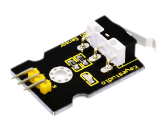
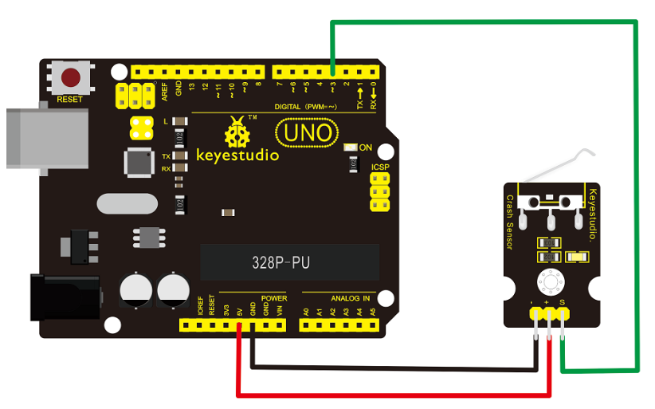
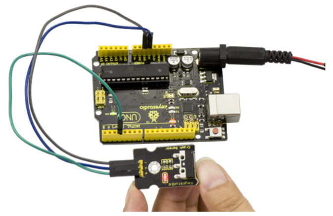

# KS0021 keyestudio Collision Sensor



## 1. Introduction

Collision sensor, also known as electronic switch, is a digital on-off input module necessary for elementary electronic learning.

By programming, it can realize control over light, sound device, key choice function of LCD display, etc.

Using 3P sensor cable to connect it to sensor shield, it can be installed to 4WD alloy mobile robot platform to realize collision detection function. It is both convenient and efficient.

**Note:**

You can make a collision flasher using collision module and built-in LED on interface 13.

Connect the collision sensor to pin 3, when the collision sensor senses a collision signal, the LEDs on main board and module will light up simultaneously.

## 2. More Details

- If collision happens upfront of where collision module is installed, module outputs low level signal; no collision, outputs high level signal.
- Module reserves M3 mounting hole, convenient for fixation on a car.
- With switch indicator light, if there is collision, light is on; no collision, light is out.

## 3. Pin Definition

- **+ pin:** 3v-12v power supply
- **- pin:** GND
- **S pin:** High-low level output

## 4. Connection Diagram



## 5. Sample Code

Download Code:  [Code](./Code.7z)

```
int Led=13;// set pin for LED 
int Shock=3// set pin for collision sensor;
int val;// set digital variable val

void setup()
{ 
    pinMode(Led,OUTPUT);// set pin LED as output
    pinMode(Shock,INPUT);// set collision sensor as input
}

void loop()
{
    val=digitalRead(Shock);// read value on pin 3 and assign it to val
    if(val==HIGH)// when collision sensor detects a signal, LED turns on.
    {
    	digitalWrite(Led,LOW);
    } 
    else
    {
    	digitalWrite(Led,HIGH);
    }
}
```

## 6. Result

Wire it up well and then upload the code to the board. When the object crashes the switch of sensor, both the led on the sensor and led 13 on the board are turned on.

